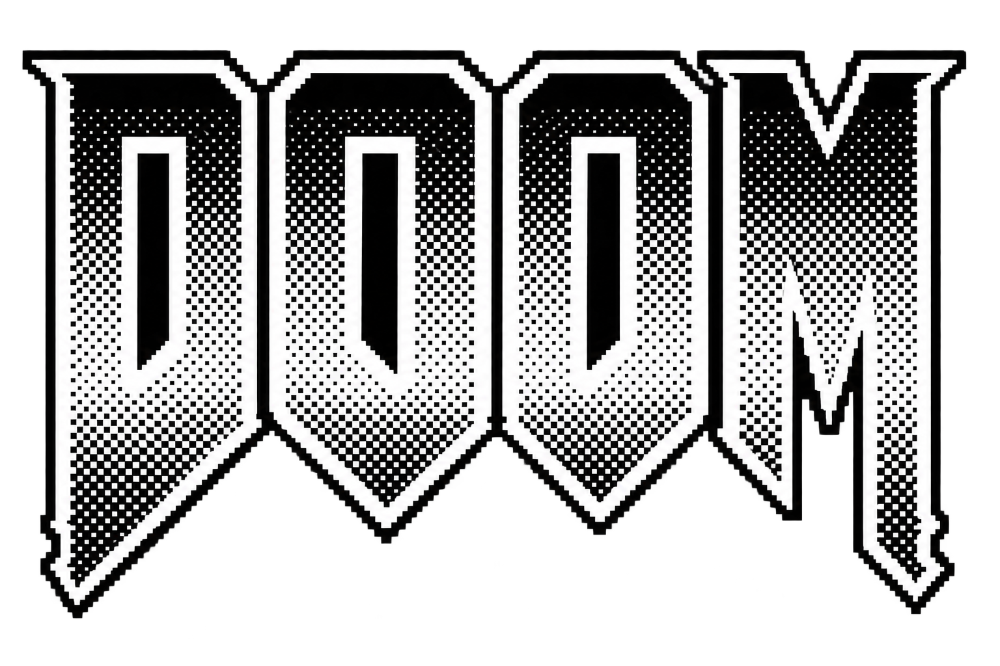

<div align="center">
  
</div>

# Doom Nano CE

A port of [Doom Nano](https://github.com/daveruiz/doom-nano/) to the TI-84 Plus CE.

## Overview

Doom Nano CE is a lightweight 3D raycasting game adapted from the original Doom Nano project, which was designed for Arduino hardware.

> **Note:** This is not the original *Doom* game. It is an original raycasting game inspired by Doom and classic Wolfenstein 3D-style rendering.

## Features

- 3D raycasting engine
- Interactive environments
- Sprite-based enemies
- Collectible items and keys
- Collision detection
- Custom text rendering
- Optimized for the TI-84 Plus CE

## Requirements

### Hardware

- TI-84 Plus CE

### Development

- [CEdev](https://github.com/CE-Programming/toolchain)
- [CEmu](https://github.com/CE-Programming/CEmu)

## Building

```bash
make
```

Debug build:

```bash
make debug
```

Or, to clean, build and run the emulator tests in one go:

```bash
./build.sh
```

The build produces:

```text
bin/DOOM.8xp
```

## Testing

Automated tests run the built program inside the headless CEmu core and check
CRCs of the calculator's screen:

```bash
make test
```

`make test` builds first, so it always tests the current sources. You need to
supply your own calculator ROM at `test/ti84pce.rom` — see
[`test/README.md`](test/README.md) for that and for how to refresh the expected
hashes after a rendering change.

## Running

### Calculator

Transfer `bin/DOOM.8xp` to your calculator using TI Connect CE and run it from the program menu.

### CEmu

Launch CEmu and send `bin/DOOM.8xp` to the emulated calculator, then run it from
the program menu.

## Controls

| Button | Action |
|--------|--------|
| `up` / `down` | Move forward / backward |
| `left` / `right` | Turn |
| `2nd` | Fire, and start the game from the title screen |
| `left` + `right` | Return to the title screen |
| `clear` | Quit to the OS |

## Project Structure

```text
DoomNanoCE/
├── src/            # Source code (including config.h)
├── include/        # Header files
├── docs/
│   └── doom-nano/  # The original Arduino sources this port follows
├── test/           # CEmu autotest support and ROM location
├── Makefile
├── autotest.json   # CEmu autotester definition
└── build.sh
```

The Arduino original under [`docs/doom-nano/`](docs/doom-nano/) is the reference
for this port — when a subsystem is ported, that is the source of truth for how
it should behave.

## Development Status

### Completed

- [x] Builds for the TI-84 Plus CE
- [x] Keypad input and clean exit to the OS
- [x] Level data and packed 4-bit map decoding
- [x] Raycasting renderer
- [x] Entity model, spawning and collision detection
- [x] Enemy AI, fireballs and pickups
- [x] All sprite art ported (font, logo, gun, muzzle flash, enemy, fireball, items)
- [x] Entity rendering: depth sorted billboards, occluded by the zbuffer
- [x] Gun rendering with walk bob and muzzle flash
- [x] Text rendering using the original 4x6 font sheet
- [x] Title screen, hud, death and return to title
- [x] Fade in/out and damage flash

### Not implemented

- [ ] Sound. The original drives a piezo buzzer from an Arduino pin; the
      TI-84 Plus CE has no speaker, so there is nothing to port it onto.
- [ ] Automated CEmu tests. The harness cannot launch programs on the ROM in
      `test/`, see [`test/README.md`](test/README.md).
- [ ] Performance work. The sprite and bitmap blitters are per-pixel and the
      frame rate suffers for it; correctness first, speed later.

## Known Limitations

- Doors, locked doors and the exit tile are inert. They are block types in the
  map data but the original never renders or acts on them either, so this port
  matches that behaviour.
- The viewport is 320x200 where the original is 128x56. Walls and sprites are
  magnified consistently, but the aspect is taller than the original's; set
  `RENDER_HEIGHT` to 140 in `src/doomnanoce.h` for a proportionally faithful
  view with a larger hud area.
- Shading uses a 256 level grayscale palette instead of the original's dither
  patterns, and fades are done by dimming that palette rather than by
  dissolving pixels.

## Credits

- **daveruiz** - Original Doom Nano project
- **lodev.org** - Raycasting resources
- **CEdev Team** - TI-84 Plus CE toolchain
- **TI-84 Plus CE community** - Development resources and testing

## License

See [`LICENSE`](LICENSE) for licensing information.

---

<div align="center">

**Doom Nano CE**

*A lightweight 3D raycasting game for the TI-84 Plus CE.*

</div>