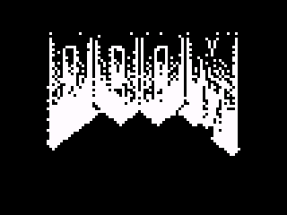

<div align="center">
  
</div>

# Doom CE

A port of [Doom Nano](https://github.com/daveruiz/doom-nano/) to the TI-84 Plus CE.

Doom Nano is a raycasting engine written by **daveruiz** for the Arduino — a
128x64 monochrome OLED driven by an ATmega328. This port moves it to the
TI-84 Plus CE's 320x240 color screen and eZ80 CPU, following the original
sources closely rather than rewriting the game.

> **Note:** this is not id Software's *Doom*. It is an original game inspired
> by Doom and by Wolfenstein 3D style raycasting.

<div align="center">
  
</div>

## Status

Playable. The engine, the level and the entity logic are all ported and
running on hardware.

**Working**

- Raycasting renderer with distance shading
- The original 64x57 level, decoded from the same packed 4-bit map data
- Enemies, fireballs, medikits and keys: spawning, AI states, collision
- Depth-sorted enemy sprites, occluded correctly by walls via the z-buffer
- Player gun with walk bob and muzzle flash
- Title screen, HUD, damage flash, death and return to title
- All of the original sprite art and its 4x6 font

**Not working / not present**

- **Sound.** The original drives a piezo buzzer from an Arduino pin. The
  TI-84 Plus CE has no speaker, so there is nothing to port it onto.
- **Automated tests.** The test harness is written but cannot launch programs
  on the ROM currently used; see [`test/README.md`](test/README.md).
- **Doors, locked doors and the exit tile are inert.** They exist as block
  types in the map data, but the original never renders or acts on them
  either, so there is no level completion to port.

## Installing

Two things have to be on the calculator:

1. **The CE C libraries.** This program links `graphx` and `keypadc`
   dynamically, so it will not start without them. Download `clibs.8xg` from
   the [CE-Programming libraries releases](https://github.com/CE-Programming/libraries/releases)
   and send it across — you only ever need to do this once per calculator.
2. **The game**, `bin/DOOM.8xp` (about 27 KB).

Transfer both with [TI Connect CE](https://education.ti.com/en/products/computer-software/ti-connect-ce-sw),
then run `prgmDOOM` from the program menu.

To run it under [CEmu](https://github.com/CE-Programming/CEmu) instead, send
the same two files to the emulated calculator.

## Controls

| Button | Action |
|--------|--------|
| `2nd` | Start the game from the title screen, and fire |
| `up` / `down` | Move forward / backward |
| `left` / `right` | Turn |
| `left` + `right` | Return to the title screen |
| `clear` | Quit to the OS |

## Building

Requires the [CE C toolchain](https://github.com/CE-Programming/toolchain) on
your `PATH`.

```bash
make            # release build -> bin/DOOM.8xp
make debug      # adds an on-screen fps / entity count readout
make clean
```

`./build.sh` cleans, builds and then runs the emulator tests; pass
`--no-test` to skip them.

VS Code users get **Build**, **Rebuild**, **Build (debug)** and **Test on
CEmu** tasks, with `Build` bound to the default build task.

## Testing

```bash
make test       # builds first, then runs the CEmu autotester
```

There are two kinds of test:

- **Emulator tests** (`autotest.json`) run the built program inside the
  headless CEmu core and compare CRCs of the screen. These currently cannot
  pass — `action|launch` does not start the program on the ROM in `test/`.
  The diagnosis is written up in [`test/README.md`](test/README.md).
- **Fixed-point verification** (`test/verify-fixed-point.py`) needs no ROM or
  emulator. It replays both the old `double` raycaster and the current fixed
  point one in Python, with C semantics, over the real level data and checks
  they agree and that nothing overflows.

## How the port works

[`docs/doom-nano/`](docs/doom-nano/) holds the original Arduino sources. They
are the reference: when a subsystem is ported, that is the source of truth for
how it should behave.

```text
src/
├── main.c          Game loop, scenes, entity logic, sprite and gun rendering
├── display.c       Raycaster, blitters, font, palette
├── level.c         Packed level data and the 4-bit map decoder
├── sprites.c       1bpp sprite art, lifted verbatim from the original
├── fixed.h         Fixed point maths for the raycaster
├── doomnanoce.h    Shared constants, types and prototypes
└── config.h        Build and hardware configuration
```

A few structural notes for anyone reading the code:

- **The screen is 2.5x wider and 3.6x taller than the original's viewport.**
  `VIEW_SCALE_X` and `VIEW_SCALE_Y` in `src/doomnanoce.h` carry the original's
  128x56 coordinates onto this screen, and sprites use the same factors so
  they stay lined up with the walls.
- **Shading replaces dithering.** The original faked brightness on a 1bpp
  panel with dither patterns. Here `setupDisplay()` installs a 256-entry
  grayscale palette, so a color index *is* a brightness, and fades are done
  by dimming the palette rather than dissolving pixels.
- **The raycaster owns the viewport.** `drawColumn` paints ceiling, wall and
  floor for every column, so there is no separate clear pass. Anything drawn
  below `RENDER_HEIGHT` would therefore never be erased — which is why the
  gun clips against it.

## Performance

The eZ80 has no FPU and runs at 48 MHz, so the original's `double` arithmetic
was the first thing to go. Three rounds of work, following the approach in
[CodePenguino/TI-84-CE-Wolfenstein](https://github.com/CodePenguino/TI-84-CE-Wolfenstein):

- **Fixed point maths.** The raycaster's inner loop used software floating
  point for every DDA step. It now uses 11 fractional bits over the eZ80's
  native 24-bit `int` (`src/fixed.h`). The precision was chosen by measuring:
  at 11 bits every column agrees with the old `double` version to within one
  pixel, 12 bits overflows, 8 bits visibly stair-steps.
- **Direct framebuffer writes.** Drawing goes straight into `gfx_vbuffer`
  instead of through per-pixel library calls, and painting full columns
  removed a 64,000 byte screen wipe from every frame.
- **Source-space sprite blitting.** `drawSprite` used to walk the screen and
  divide twice per pixel to find the source texel, so an enemy at point blank
  range cost 64,000 iterations and 128,000 divides. It now walks the source
  art — at most 32x32 however close the enemy gets — and coalesces runs of
  equal texels into one `memset` per row. The gun, redrawn every frame, went
  from 2,943 `memset` calls to 507.

Still on the table: unrolling the wall column writes, and the LCD register
trick that stretches a 160-pixel-wide framebuffer across the full panel, which
would halve the fill cost outright.

## Differences from the original

- The viewport is 320x200 against the original's 128x56, so the view is
  proportionally taller. Set `RENDER_HEIGHT` to 140 in `src/doomnanoce.h` for
  the original's aspect ratio and a larger HUD area.
- Enemies only exist within about 10 cells and in line of sight, and are
  deleted and respawned as you move — this is the original's behavior, and it
  means only one to three of the map's 22 enemies are live at once.
- Shading and fades use the grayscale palette described above.
- `[clear]` quits to the OS. The Arduino original simply runs forever.

## Credits

- **[daveruiz](https://github.com/daveruiz/doom-nano/)** — the original Doom Nano
- **[lodev.org](https://lodev.org/cgtutor/raycasting.html)** — raycasting reference
- **[CE-Programming](https://github.com/CE-Programming/toolchain)** — the TI-84 Plus CE toolchain
- **[CodePenguino](https://github.com/CodePenguino/TI-84-CE-Wolfenstein)** — eZ80 raycaster optimization techniques

## License

See [`LICENSE`](LICENSE).
